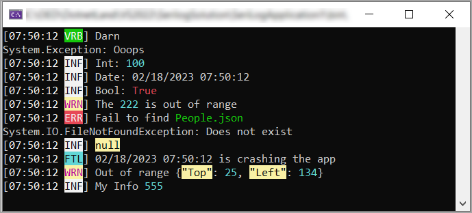

## SeriLog custom themes

Provides a class project for overriding SeriLog console colors.

See the following for [usage](SeriLogThemesLibrary/readme.md)

:pushpin: Requires Microsoft Visual Studio 2022 or higher, .NET Core 7 or higher

## Theme 1

## Theme 2

## Theme 3

## Theme 4

## Theme 5

